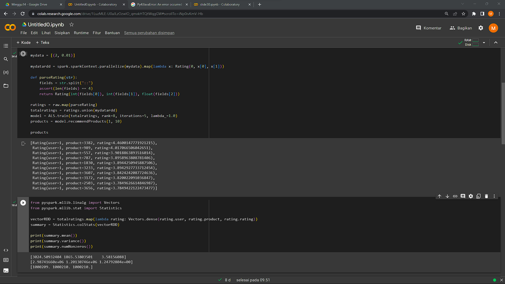

## Nama      : Muhammad Hamamiy Zadah
## Kelas     : TI - 3C
## No. Absen : 12
##

### Slide 30

1. mount google drive untuk akses dataset/file, Dan install pyspark

2. kemudian import pyspark, dan SparkSession baru. import library pyspark.ml, dan pyspark.sql.

3. Kemudian read file ratings.dat pada google drive. kemudian lakukan RDD mapping. Membuat model rekomendasi menggunakan ALS pada training data yang telah dibuat sebelumnya.

### Slide 48
Load textFile Ratings.dat kemudian parallelize variable myData dan mapping file yg telah di load. Kemudian train totalRatings menggunakan metode ALS untuk mendapatkan rekomendasi produk.

### Slide 49
Menampilkan statistik summary mulai dari rata", varian, dll dari vectorRdd rating yang telah di proses sebelumnya

### Slide 52
Import library ml KMeans dan Vectors. kemudian load kmeans_data.txt . Selanjutnya mapping dataset dan konversi menjadi dari RDD menjadi DataFrame, memasukkan variable parsedData pada method kmeans.fit, Menampilkan summary dari training cost dan prediksi cluster tiap data.

### Slide 53-54
Import library Kmeans, Numpy, dan Math. Kemudian membaca file kmeans_data.txt setelah itu melakukan mapping dengan patokan tiap data dipisahkan menggunakan delimiter spasi . kemudian training data dengan Kmeans. dengan jumlah kluster 2 dan maksimal iterasi 10. Menghitung WSSE dari parsedData kemudian melakukan saving model pada zadah_prak.

Jika dilihat pada sidebar, maka akan terbentuk file clusters yang telah disimpan pada folder zadah_prak.

